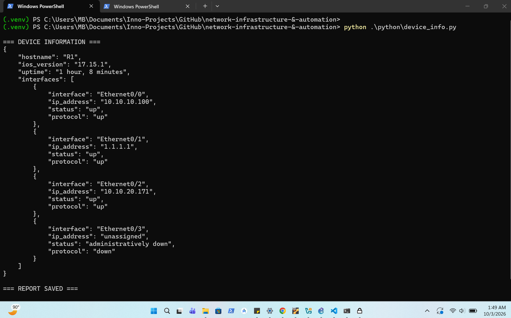
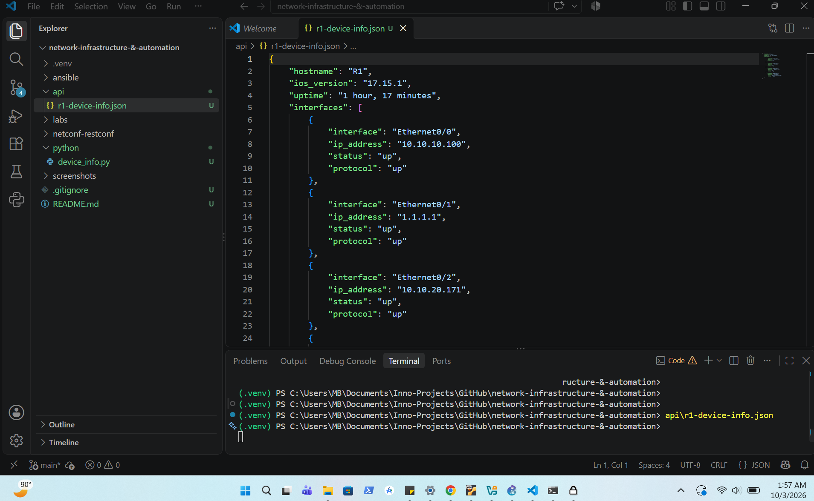
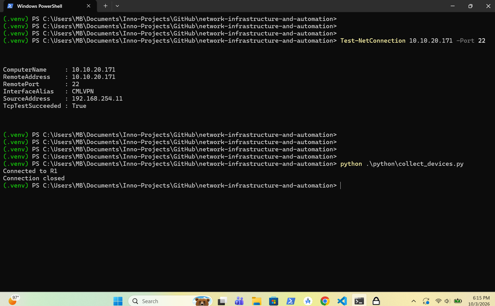
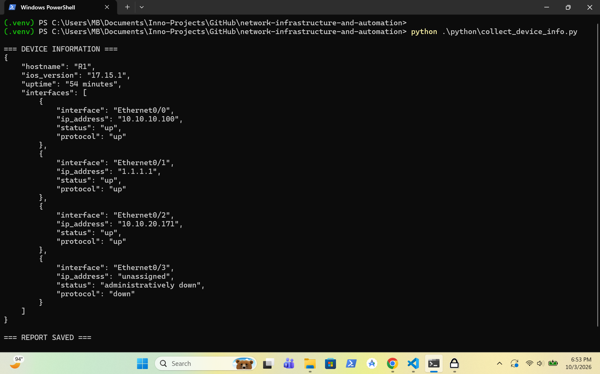

# Network Infrastructure & Automation

## Overview

Practical network infrastructure and automation labs covering Python, Netmiko, Ansible, APIs, NETCONF, RESTCONF and YANG.

The project focuses on automating real network operations, collecting structured device information, applying configuration changes and building reusable automation workflows.

The labs progress from Python-based network automation into multi-device automation, API-driven workflows and Cisco network programmability.

## Project Structure

```text
network-infrastructure-and-automation/
├── ansible/
├── api/
├── inventory/
├── labs/
├── netconf-restconf/
├── python/
├── screenshots/
├── .gitignore
└── README.md
```

---

## Screenshots

### 1. Python Device Information Automation

Shows Python connecting to Cisco R1 using Netmiko and collecting device information.



---

### 2. Structured Device Information

Shows the structured device information generated from the Cisco device.



---

### 3. Inventory-Driven Netmiko Connection

Shows Python reading the device inventory and successfully establishing a Netmiko connection to Cisco R1.



---

### 4. Inventory-Driven Device Information

Shows the inventory-driven automation collecting and structuring Cisco R1 device information and generating the JSON report.



---